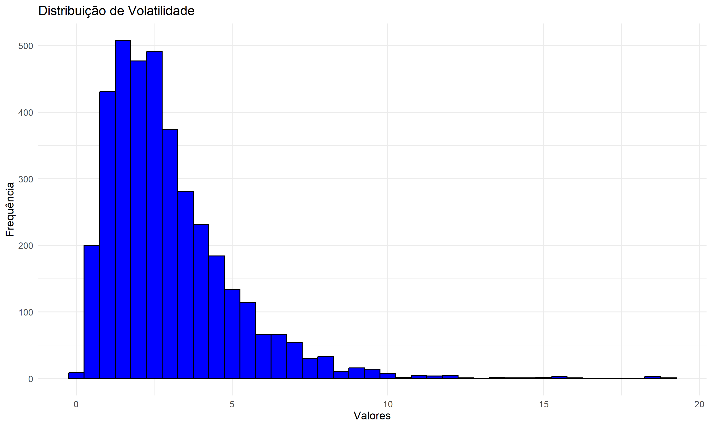
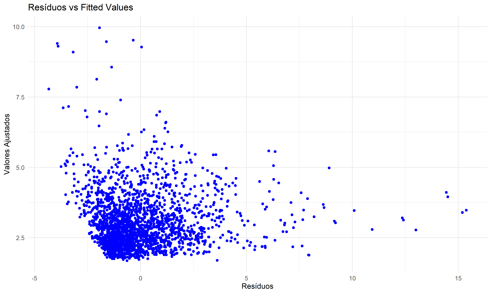

# Análises de Volatilidade do Bitcoin

## Cotação Histórica

O gráfico de Cotação Histórica exibe a evolução do preço do ativo (no caso, Bitcoin) ao longo do tempo.

## Histograma da Volatilidade

Este histograma mostra como os valores de volatilidade (Alvo) estão distribuídos no conjunto de dados.
O objetivo aqui é entender se a volatilidade tem distribuição normal, se é simétrica ou assimétrica (neste caso, é assimétrica à direita, indicando eventos extremos raros).

## Heatmap de Correlações

A matriz mostra o grau de correlação linear entre todas as variáveis que eu utilizei na modelagem da volatilidade do Bitcoin. Cada valor na matriz representa a correlação entre duas variáveis específicas.

## 

### Resultados da Regressão Linear

A regressão linear foi realizada com a fórmula:

Alvo ~ Volume + Retorno + Retorno_p + Proporção + Desvio

#### Resíduos:

- Mínimo: -4.3295
- 1º Quartil: -1.2783
- Mediana: -0.4692
- 3º Quartil: 0.7590
- Máximo: 15.3813

#### Coeficientes:

| Variável    | Estimativa    | Erro Padrão   | t-valor  | p-valor   |
|-------------|---------------|---------------|----------|-----------|
| Intercepto  | 1.641e+00     | 7.707e-02     | 21.291   | < 2e-16 **|
| volume      | 7.274e-12     | 3.301e-12     | 2.204    | 0.027642 * |
| Retorno     | -4.206e-02    | 1.781e-02     | -2.361   | 0.018319 * |
| Retorno_p   | 2.901e-02     | 7.578e-03     | 3.828    | 0.000133 **|
| Proporcao   | 1.369e-01     | 1.190e-01     | 1.151    | 0.249830   |
| Desvio      | 4.253e-01     | 1.899e-02     | 22.396   | < 2e-16 **|

**Notas:**
- Significação dos p-valores: 
  - **p < 0.001**: altamente significativo
  - **p < 0.05**: significativo
  - **p > 0.05**: não significativo

#### Estatísticas do Modelo:

- Erro padrão dos resíduos: 2.022 (com 2172 graus de liberdade)
- R-quadrado múltiplo: 0.201
- R-quadrado ajustado: 0.1992
- Estatística F: 109.3 (com 5 e 2172 graus de liberdade)
- p-valor da estatística F: < 2.2e-16

Análise dos Resultados

Apesar de algumas variáveis não apresentarem significância, o modelo geral é significativo. No entanto, o R-quadrado relativamente baixo sugere que há bastante espaço para melhorar o modelo, talvez incluindo mais variáveis ou considerando transformações nas variáveis existentes. No geral o modelo indica que de fato algumas variáveis estão realmente influenciando o comportamento de Alvo de forma importante.

## Real vs Previsto

Este gráfico é o scatter plot que compara a Volatilidade Prevista pelo modelo com a Volatilidade Real que ocorreu no conjunto de teste.
Em um modelo perfeito (que não é o caso) todos os pontos cairiam exatamente sobre uma linha diagonal reta (onde Volatilidade Prevista = Volatilidade Real).
Entretando o modelo tem algum poder preditivo a nuvem de pontos tende a se mover da parte inferior esquerda para a parte superior direita. Isso significa que, em geral, quando o modelo prevê uma volatilidade maior, a volatilidade real também tende a ser maior, e quando prevê menor, a real tende a ser menor. Há uma relação positiva, o que é um bom sinal.

## Volatilidade ao Longo do Tempo

Este segundo gráfico é uma visualização da série temporal da Volatilidade Real (linha vermelha) versus a Volatilidade Prevista pelo seu modelo (linha azul) ao longo do tempo.
Este gráfico confirma o que vimos no exemplo acima. O modelo é capaz de seguir a direção geral da volatilidade ao longo do tempo, mas falha significativamente em prever a magnitude real dos movimentos de volatilidade. 

## Resíduos vs Fitted

Este é um Gráfico de Resíduos vs. Valores Ajustados (Fitted Values).
É um gráfico de diagnóstico padrão para avaliar a adequação de um modelo de regressão linear, geralmente gerado a partir dos dados de treinamento.
Um grafico ideal deve conter pontos espalhados aleatoriamente em torno da linha horizontal em y=0
Não apresentar formas de funil, cone ou curvaturas.

Nosso modelo entretanto apresenta uma heterocedasticidade significativa, isso é, a dispersão dos resíduos aumnta claramente é medida que os valores ajustados aumentam.

A forma de nuvem nos pontos também pode sugerir que a relaçao entre seus preditores e a volatilidade não é estritamente linear.

## Q-Q Plot dos Resíduos

Esse é outro grafico de diagnostico padrão para modelos de regressão linear, usado para verificar se a distribuição dos residuos do modelo se aproxima de uma distribuição normal.

Eixo X: Representa os quantis esperados de uma distribuição normal padrão.
Eixo Y: Representa os quantis reais da distribuição dos seus resíduos.

A linha azul reta representa onde os pontos deveriam cair se os resíduos fossem perfeitamente normalmente distribuídos.

Como pode ser facilmente observado, os pontos se afastam significativamente da linha azul, especialmente nas pontas da distribuição. Isso é uma indicação clara de que os resíduos do seu modelo não são normalmente distribuídos.

## Gráficos Parciais

Esse é uma grade de Gráficos de Regressão Parcial para cada uma das variaveis preditoras que utilizamos, cada grafico tenta visualizar a relação entre a variável Y e uma unica variavel X, após remover todas as outras variáveis preditoras do modelo.

Dos graficos observados, somente o Desvio parece demosntrar uma boa relação linear parcial clara e positiva com a nossa variavel Y neste modelo.

## Conclusão

O modelo de regressão linear construído mostrou ser estatisticamente significativo no geral, indicando que o conjunto de preditores tem, de fato, alguma capacidade de explicar a volatilidade futura. As análises de correlação e os gráficos parciais destacaram o Desvio como o preditor linear mais relevante neste modelo, com uma relação positiva clara e importante com a variável alvo.

No entanto, a análise dos resultados de predição e dos gráficos de diagnóstico revela grandes limitações, embora o modelo linear forneça um ponto de partida e identifique a importância da volatilidade passada, ele não é totalmente adequado para modelar a natureza complexa da volatilidade financeira.

Como tarefa futura, pretendo buscar features adicionais ou até mesmo modificações nas existentes buscando capturar melhor a dinâmica da volatilidade do mercado e explorar novos modelos mais avançados.
